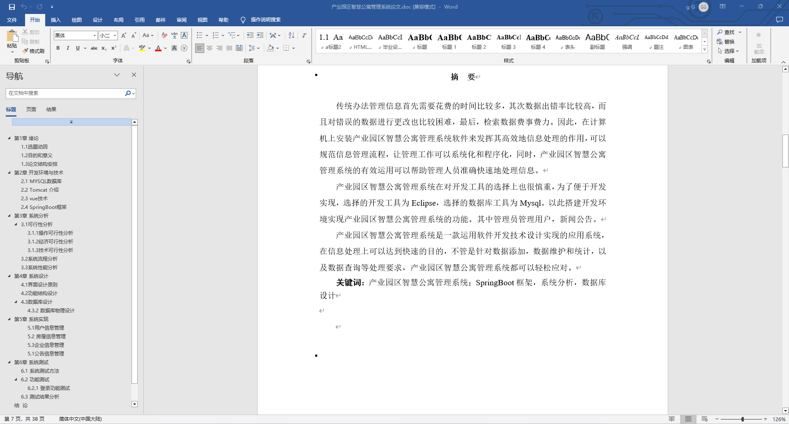
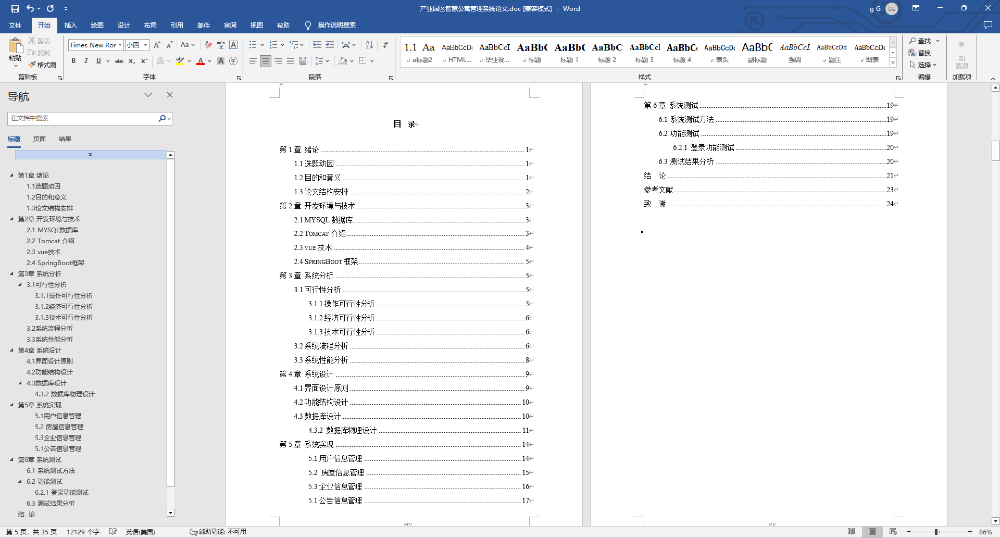
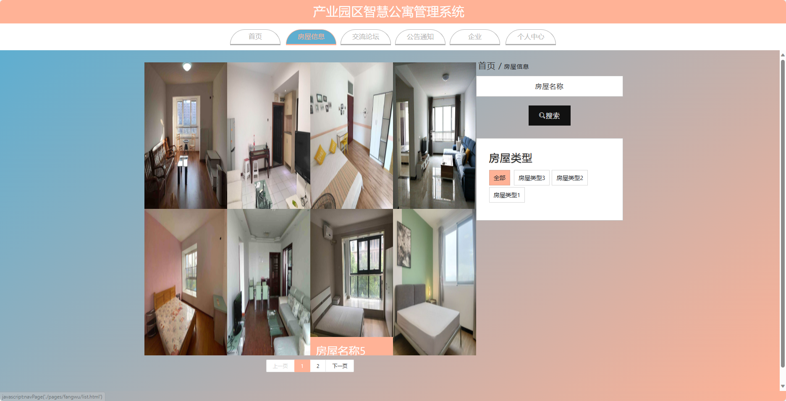
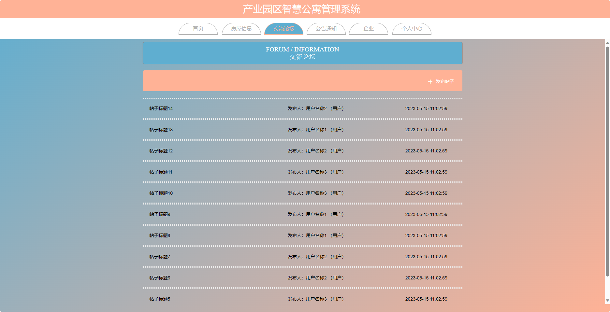
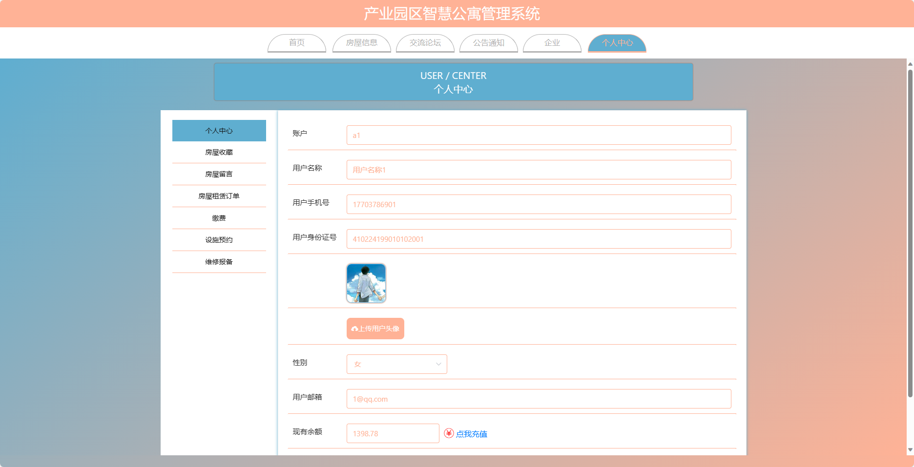
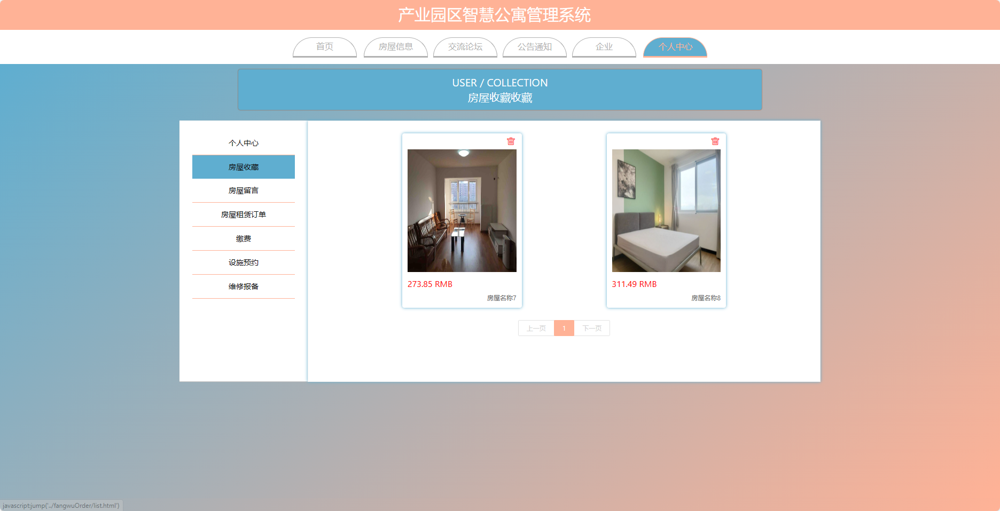
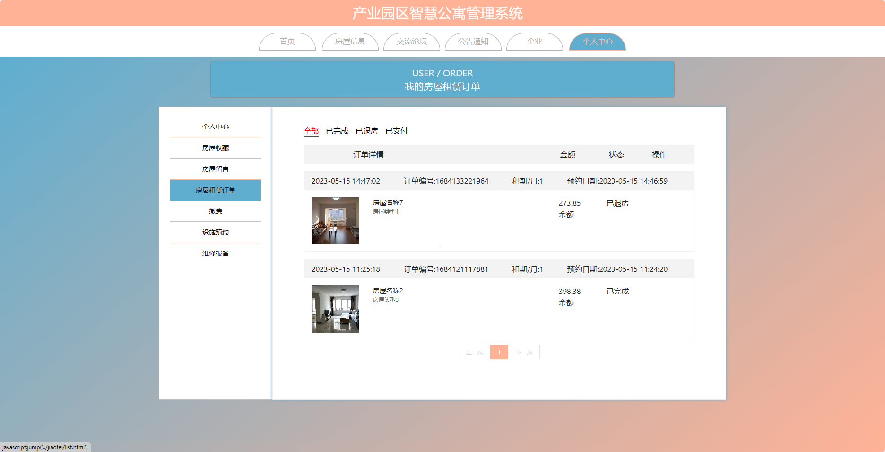
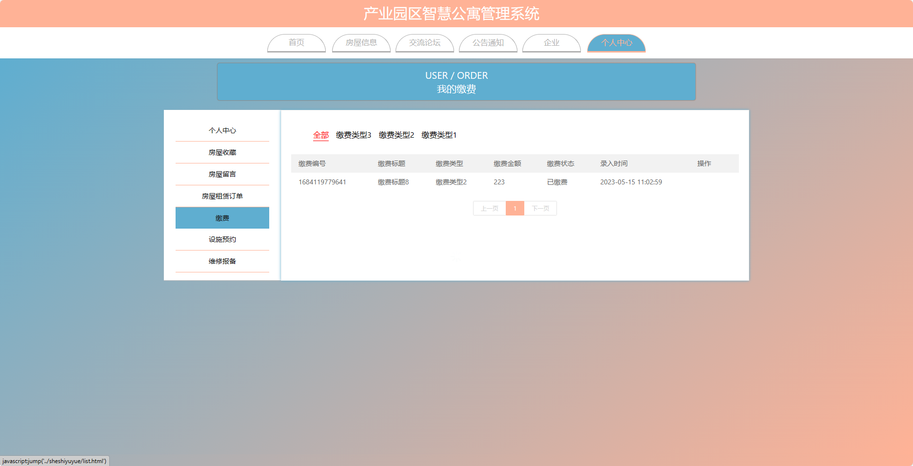
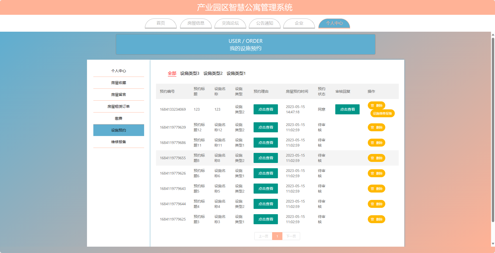

基于SpringBoot的产业园区智慧公寓管理系统（程序+论文）
=
- 完整代码获取地址：从戎源码网 ([https://armycodes.com/](https://armycodes.com/))
- 作者微信：19941326836  QQ：952045282 
- 承接计算机毕业设计、Java毕业设计、Python毕业设计、深度学习、机器学习
- 选题+开题报告+任务书+程序定制+安装调试+论文+答辩ppt 一条龙服务
- 所有选题地址https://github.com/nature924/allProject

一、项目介绍
---
基于Spring Boot框架实现的产业园区智慧公寓管理系统，系统包含两种角色：管理员、企业用户、用户,系统分为前台和后台两大模块，主要功能如下。

### 前台：
- 首页：展示公寓的基本信息、房屋租赁信息等，提供导航链接。
- 房屋信息：展示公寓内各个房屋的信息，包括房屋类型、面积、价格、租赁状态等。
- 交流论坛：提供租户之间的交流平台。
- 公告通知：展示公寓发布的最新公告和通知。
- 企业：展示与公寓相关的企业信息。
- 个人中心：用户可以管理个人信息。

### 后台：
- 企业用户个人中心：企业用户可以管理个人信息，包括修改密码、查看个人信息等。
- 企业管理：管理员可以管理公寓内的企业信息，包括添加、删除、编辑等操作。
- 房屋信息管理：管理员可以管理公寓内的房屋信息，包括添加、删除、编辑等操作。
- 缴费管理：管理员可以管理租户的缴费情况，包括查看缴费记录、发送提醒等操作。
- 设施预约管理：管理员可以管理公寓内的设施预约情况，包括添加、删除、编辑等操作。
- 维修报备管理：管理员可以管理维修报备情况，包括查看报备记录、分配维修任务等操作。
- 交流论坛管理：管理员可以管理交流论坛的内容，包括审核、删除违规内容等操作。
- 公告通知管理：管理员可以管理公寓发布的公告信息，包括添加、删除、编辑等操作。
- 管理员个人中心：管理员可以管理个人信息，包括修改密码、查看个人信息等。
- 管理员管理：管理员可以管理其他管理员账号，包括添加、删除、编辑等操作。
- 用户管理：管理员可以管理租户账号，包括查看用户列表、禁用用户等操作。
- 企业用户管理：管理员可以管理企业用户账号，包括查看用户列表、禁用用户等操作。
- 基础数据管理：管理员可以管理系统的基础数据，如网站配置、分类信息等。
- 轮播图信息：管理员可以管理首页轮播图的展示内容。

二、项目技术
---
- 编程语言：Java
- 数据库：MySQL
- 项目管理工具：Maven
- 前端技术：VUE、HTML、Jquery、Bootstrap
- 后端技术：Spring、SpringMVC、MyBatis

三、运行环境
---
- 操作系统：Windows、macOS都可以
- JDK版本：JDK1.8以上都可以
- 开发工具：IDEA、Ecplise、Myecplise都可以
- 数据库: MySQL5.7以上都可以
- Tomcat：任意版本都可以
- Maven：任意版本都可以

四、运行截图
---
### 论文截图：

### 程序截图：

